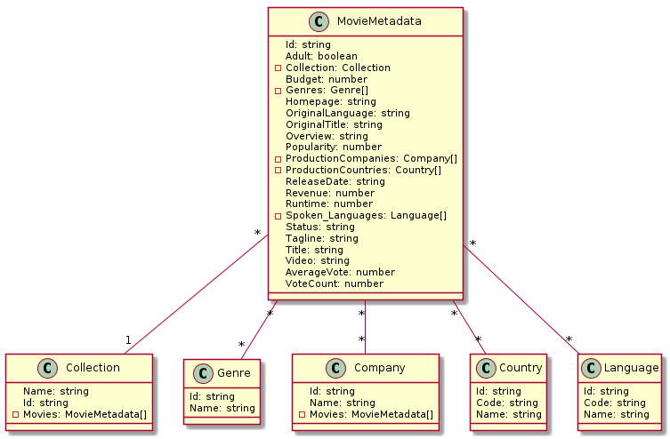

# seminar-databases-and-express

## typeorm Branch

MariaDB + TypeORM - relational DB

## ogmneo Branch

Neo4j + OGMNeo - graph-oriented DB

## mongoose Branch

MongoDB + mongoose (ODM) - document-oriented DB

## Data-Model

